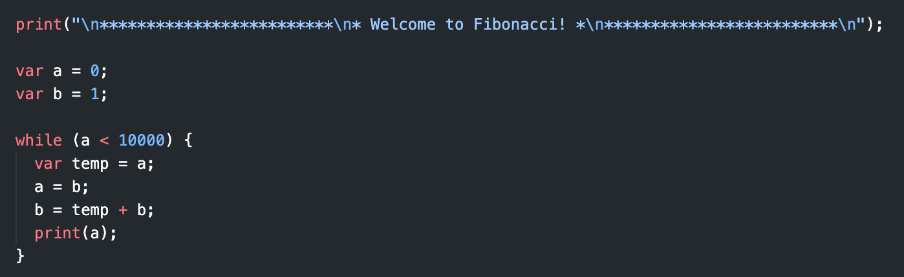

# Plon Lang extension for VSCode

Enables syntax highlighting for Plon files and Grammar notation files. Additionally, it provides snippets for Plon files. Furthermore, it adds syntax highlighting to .grammar files (just files in [Bob Nystrom's grammar notation](https://www.craftinginterpreters.com/representing-code.html#rules-for-grammars)).

## Features

This extension adds syntax highlighting to .plon files.

## Known Issues

Multiline comments aren't correctly highlighted as such. (If you know how to fix it, please PR a fix).

## Release Notes

### 1.0.1

Tentative approach at syntax highlighting inside Markdown code blocks.

### 1.0.0

Initial release of Plon Lang w/ Grammar notation support.
